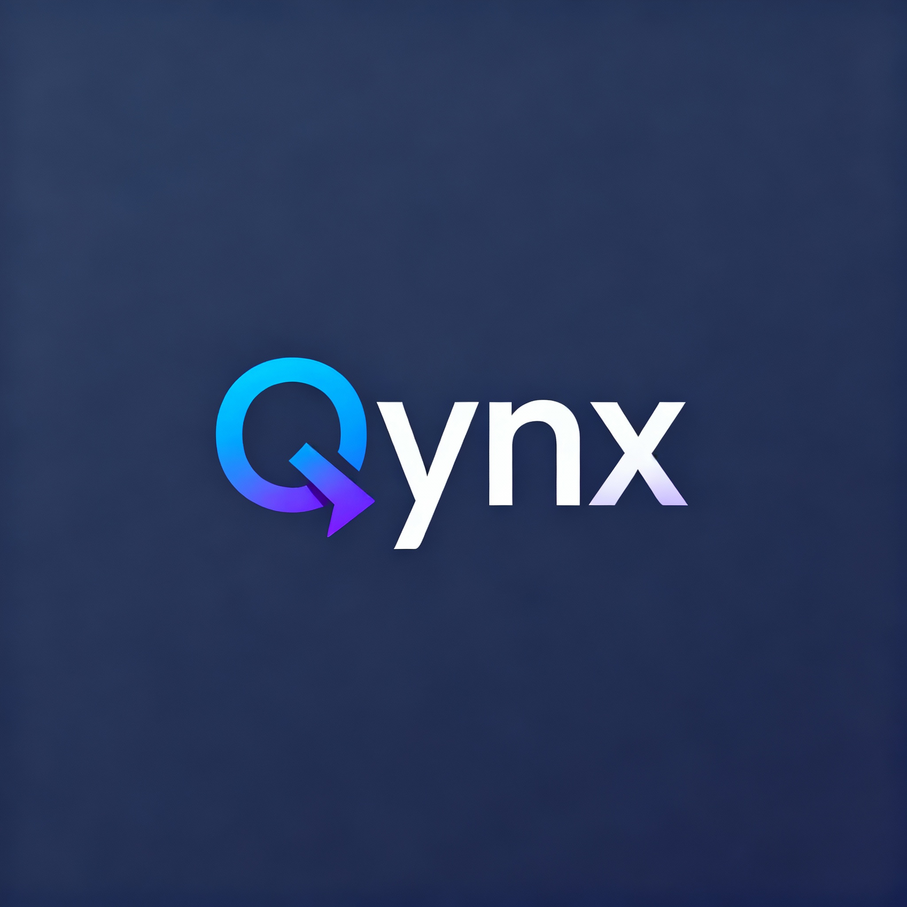

# Qynx - P2P Sharing Web Application

<p align="center">
  
</p>

A Modern, P2P file sharing web application built with Next.js, featuring drag & drop uploads, password-protected downloads, and a beautiful glassmorphism UI.

## Features

- 🚀 **Drag & Drop Uploads** - Intuitive file uploading with overwrite confirmation
- 🔒 **Secure File Management** - Password-protected file access
- 🎥 **Media Viewer** - Full-featured video player with controls
- 📁 **File Operations** - Rename, delete, and download files
- 🎨 **Modern UI** - Glassmorphism design with dark mode support
- 📱 **Responsive** - Works perfectly on desktop and mobile
- ♿ **Accessible** - Full screen reader support

## Tech Stack

- **Frontend**: Next.js 15, React, TypeScript
- **UI**: Radix UI, Tailwind CSS
- **Web Server**: Ngrok webserver
- **Backend**: Next.js API Routes
- **File Handling**: Chunked Downloads (ADM Like)

## Getting Started

1. Clone the repository
2. Install dependencies: `npm install`
3. Run development server: `npm run dev`
4. Open [http://localhost:9002](http://localhost:9002)

## Environment Variables

1. Create a `.env` file with: ```QYNX_PASSWORD=your_secure_password_here```
2. Put your ngrok auth token in the `.env` file: ```NGROK_AUTH_TOKEN=your_ngrok_auth_token_here```
3. Put your ngrok region in the `.env` file: ```NGROK_REGION=your_ngrok_region_here```
4. Put your ngrok port in the `.env` file: ```NGROK_PORT=your_ngrok_port_here```

## Usage

- Upload files by dragging and dropping or clicking the upload button
- Click on files to view media content
- Use the dropdown menu for file operations
- Access password-protected files securely
- to run the app locally ``npm install`` and ``npm build`` then ``npm run start``.
- to run the app on ngrok simply ``npm run share``.

## License

MIT License
